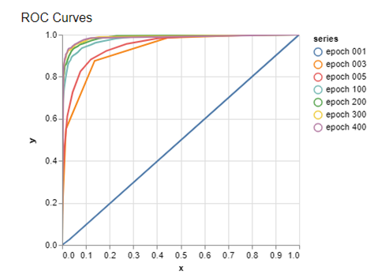

# ROC (Receiver Operating Characteristic)

ROC curve 是一個用來評估模型好壞的方法，這方法有個很好的特性：**當測試集中的正負樣本的分佈變化的時候，ROC 曲線能夠保持不變**。

在實際的數據集中經常會出現類不平衡（class imbalance）現象，即負樣本比正樣本多很多（或者相反），而且測試數據中的正負樣本的分佈也可能隨著時間變化。

在說明 ROC curve 怎麼會製出來之前，需要了解一些名詞，利用一個簡單的例子來說明:

假設有一個分類器是用來分辨該網站是否為釣魚網站(phishy)，True positive、False positive、True negative 和 False negative 定義如下:

- True positive (TP): Is phishy, identified phishy
- False positive (FP): Not phishy, identified as phishy
- True negative (TN): Not phishy, identified as not phishy
- False negative (FN): Is phishy, identified as not phishy

藉由上述的定義可以將其匯總成一張表格，如下:

|  | Is phishy | Not phishy |
| --- | --- | --- |
| Identified as phishy | True positive (TP) | False positive (FP) |
| Identified as not phishy | False negative (FN) | True negative (TN) |

接著定義兩個數值，False positive rate 和 True Positive Rate，如下:

- False positive rate (FPR)  
  
  

- True Positive Rate (TPR)  

  

對於一個特定的分類器, 測試數據集和分類其閥值，顯然只能得到一個分類結果，即一組 FPR 和 TPR 結果，而要得到一個曲線，我們實際上需要一系列 FPR 和 TPR 的值。就透過設置不同的閥值就可以獲得一系列的 FPR 和 TPR。

下圖為一張 ROC curve 的圖，圖中很多條 ROC curve 是根據在不同 epoch 的時候所繪製下來的。ROC 曲線的橫坐標為 false positive rate（FPR），縱坐標為 true positive rate（TPR)。圖中有一條對角直線，這條直線說明分類器的結果跟丟銅板一樣，越往左上角說明模型越好，右下角模型越差。

